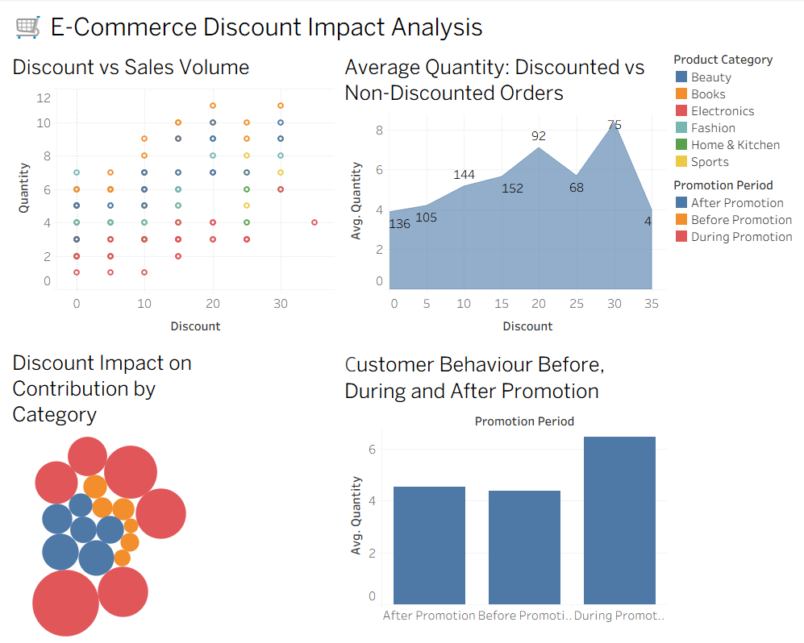

# 🛒 E-Commerce Discount Impact Analysis

## Does Discount Really Increase Profit?

---

## 📌 1. Project Overview

This project analyzes whether discounts offered by an online retailer actually increase sales volume and whether the additional sales are sufficient to maintain healthy business contribution.

The analysis focuses on the relationship between:

- Discount percentage
- Selling price
- Quantity sold
- Revenue
- Logistics cost
- Estimated contribution
- Product category
- Promotion period
- Customer behaviour

The project combines **Data Cleaning, Exploratory Data Analysis, Statistical Analysis, Machine Learning, and Tableau Visualization** to generate business insights.

---

# ❓ 2. Problem Statement

Online retailers frequently provide discounts to attract customers and increase sales.

However, higher sales volume does not necessarily mean higher profit.

For example, a large discount may increase the number of products sold, but the reduction in selling price may reduce the contribution generated from each order.

Therefore, the main question of this project is:

> **Does discount really increase sales enough to justify the reduction in selling price and additional logistics cost?**

---

# 🎯 3. Objectives

The objectives of this project are:

1. Clean and validate the E-Commerce dataset.
2. Perform Exploratory Data Analysis.
3. Create additional business-related features.
4. Calculate revenue and estimated contribution.
5. Compare discounted and non-discounted orders.
6. Analyze the relationship between discount and sales quantity.
7. Analyze different discount levels.
8. Compare discount performance across product categories.
9. Analyze customer behaviour before, during, and after promotions.
10. Perform statistical analysis.
11. Build a Linear Regression model.
12. Predict sales quantity.
13. Evaluate model performance.
14. Create a Tableau dashboard.
15. Identify key business insights.
16. Provide practical recommendations.

---

# 📊 4. Dataset

The dataset contains **150 E-Commerce order records**.

## Dataset Columns

| Column | Description |
|---|---|
| `Order_ID` | Unique order identifier |
| `Product_Category` | Product category |
| `Original_Price` | Original price before discount |
| `Discount` | Discount percentage |
| `Selling_Price` | Final price after discount |
| `Quantity` | Number of units purchased |
| `Logistics_Cost` | Logistics cost |
| `Customer_ID` | Customer identifier |
| `Promotion_Period` | Before, During, or After Promotion |

---

# 🛠️ 5. Technologies Used

### Programming

- Python

### Libraries

- Pandas
- NumPy
- Matplotlib
- Seaborn
- SciPy

### Machine Learning

- Scikit-learn
- Linear Regression

### Visualization

- Tableau

### Environment

- Google Colab
- Google Drive

### Version Control

- Git
- GitHub

---
# 📊 Tableau Dashboard

The Tableau dashboard was created to visualize the major findings from the E-Commerce discount analysis.

The dashboard contains four visualizations:

1. Discount vs Sales Volume
2. Discounted vs Non-Discounted Orders
3. Discount Impact on Contribution by Category
4. Customer Behaviour Before, During and After Promotion

## Dashboard Preview

<p align="center">
  
</p>

# 🔄 6. Project Workflow

```text
Dataset
   ↓
Data Cleaning & Validation
   ↓
Feature Engineering
   ↓
Exploratory Data Analysis
   ↓
Revenue & Contribution Analysis
   ↓
Discount Analysis
   ↓
Category Analysis
   ↓
Promotion Period Analysis
   ↓
Statistical Analysis
   ↓
Linear Regression
   ↓
Model Evaluation
   ↓
Tableau Dashboard
   ↓
Key Insights
   ↓
Business Recommendations
